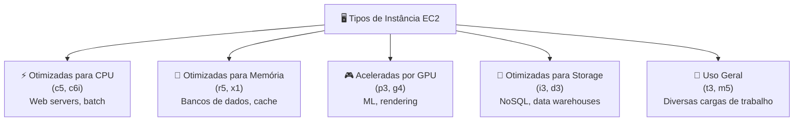
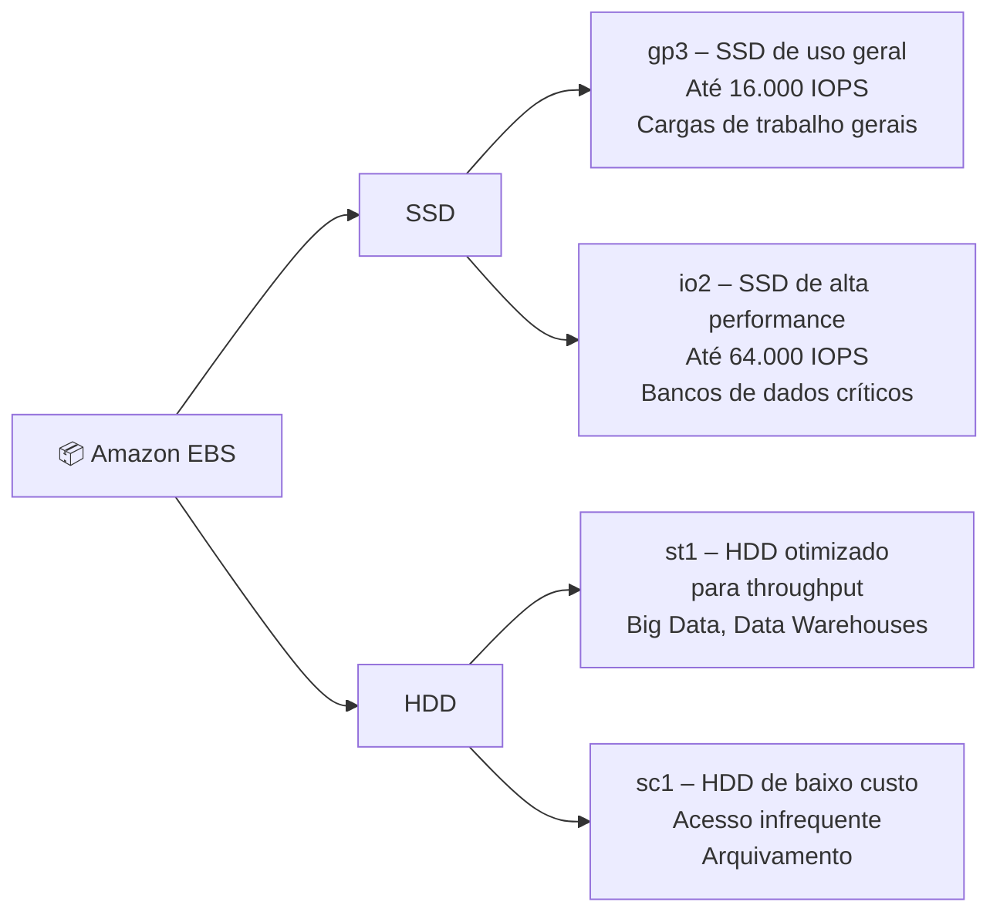
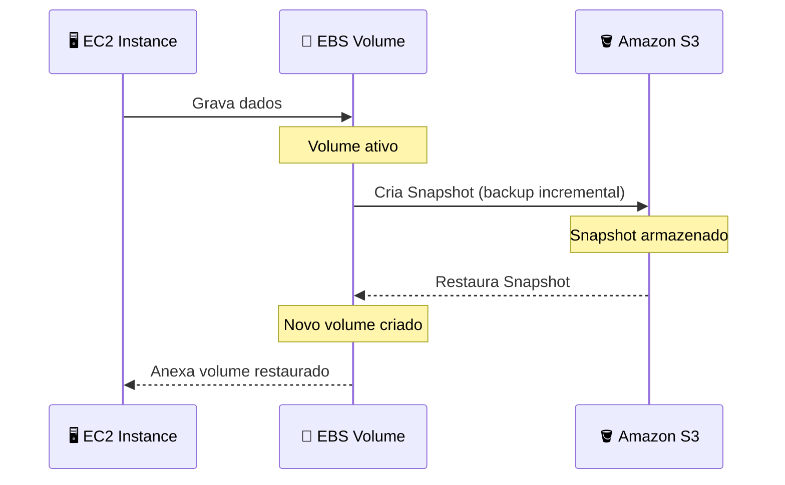
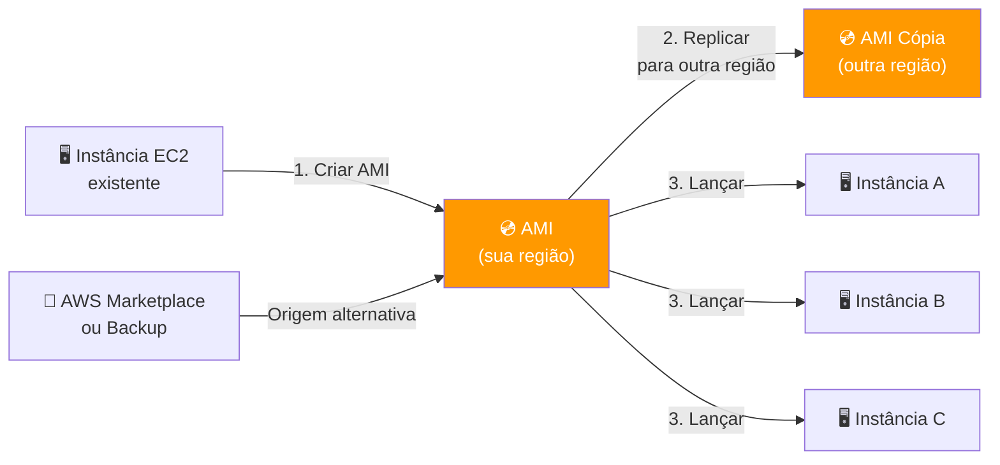
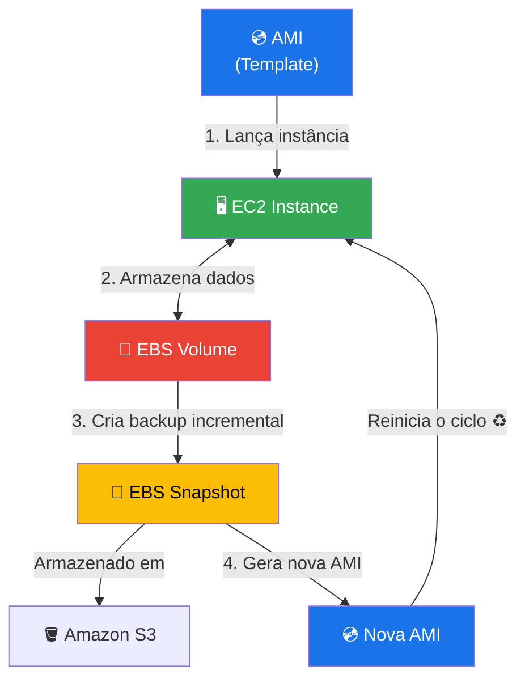
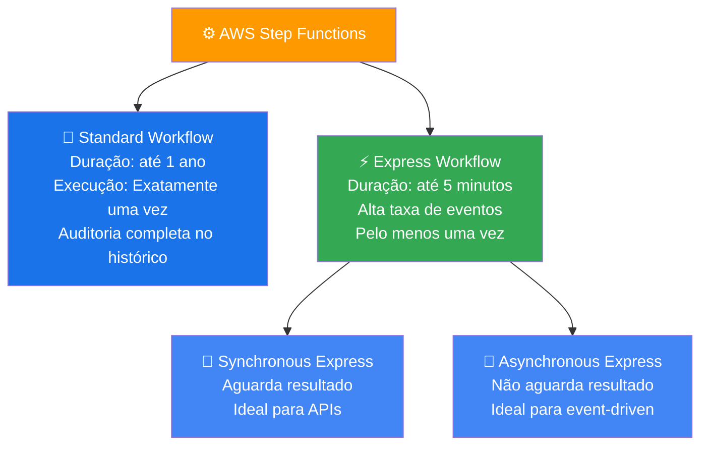
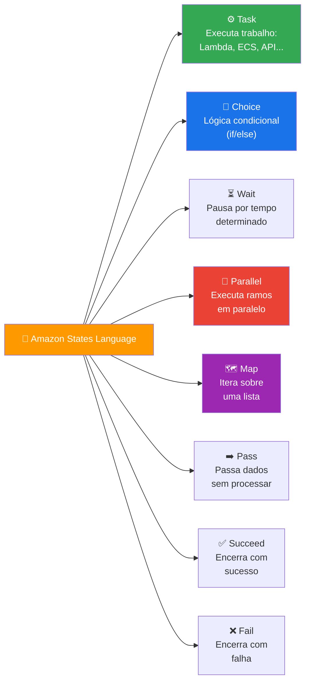
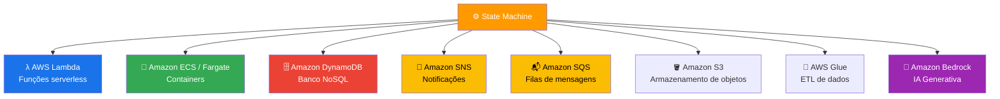

# GFT - Fundamentos de Cloud com AWS

Anotações e resumos do curso **GFT - Fundamentos de Cloud com AWS**, cobrindo os principais conceitos e serviços da Amazon Web Services estudados ao longo do programa.

---

## ☁️ EC2, EBS e AMI — Fundamentos de Infraestrutura

Visão geral técnica e prática sobre os pilares fundamentais da infraestrutura computacional na AWS: **Amazon Elastic Compute Cloud (EC2)**, **Amazon Elastic Block Store (EBS)** e **Amazon Machine Images (AMI)**.

---

## 🚀 1. Amazon EC2 (Elastic Compute Cloud)

O Amazon EC2 é um serviço que fornece capacidade computacional escalável na nuvem. Ele elimina a necessidade de investir em hardware antecipadamente, permitindo que você lance servidores virtuais conforme a demanda.

### Principais Características

- **Instâncias:** Servidores virtuais que executam suas aplicações.
- **Escalabilidade:** Capacidade de aumentar ou diminuir recursos em minutos.
- **Tipos de Instância:** Otimizadas para diferentes casos de uso (CPU, Memória, GPU, Armazenamento).
- **Segurança:** Controle total via Security Groups (firewalls virtuais).

### Tipos de Instância EC2



---

## 💾 2. Amazon EBS (Elastic Block Store)

O Amazon EBS fornece volumes de armazenamento em bloco de alto desempenho para uso com instâncias EC2. Pense no EBS como o **"disco rígido"** da sua instância virtual.

### Conceitos Chave

- **Persistência:** Os dados persistem mesmo se a instância for interrompida ou encerrada (se configurado).
- **Snapshots:** Backups incrementais que são salvos no Amazon S3.
- **Tipos de Volume:**
  - **SSD (gp3/io2):** Para cargas de trabalho transacionais e bancos de dados.
  - **HDD (st1/sc1):** Para grandes volumes de dados e processamento sequencial.
- **Elasticidade:** Altere o tamanho ou o tipo de volume sem tempo de inatividade.

### Tipos de Volume EBS



### Ciclo de Vida de um Snapshot EBS



---

## 💿 3. AMI (Amazon Machine Image)

Uma AMI é um **modelo** que contém a configuração de software (sistema operacional, servidor de aplicativos e aplicações) necessária para lançar uma instância.

### Componentes de uma AMI

- **Template do Volume Raiz:** Contém o SO e aplicações instaladas.
- **Permissões de Lançamento:** Define quais contas AWS podem usar a AMI.
- **Mapeamento de Dispositivos de Bloco:** Especifica os volumes EBS a serem anexados à instância no lançamento.

### Ciclo de Vida de uma AMI



---

## 🔗 Relacionamento entre os Componentes

A relação entre esses três serviços é o que permite a flexibilidade da nuvem:

1. Você escolhe uma **AMI** (o "molde" do sistema).
2. Você lança uma **instância EC2** baseada nessa AMI.
3. A instância utiliza **volumes EBS** para armazenamento persistente.
4. Você pode criar novos **Snapshots** dos volumes EBS para gerar novas AMIs, fechando o ciclo de backup e replicação de ambiente.



### Resumo do Fluxo

| Etapa | Serviço | Ação |
|-------|---------|------|
| 1 | **AMI** | Fornece o template (SO + configurações) |
| 2 | **EC2** | Instância lançada a partir da AMI |
| 3 | **EBS** | Volume anexado para armazenamento persistente |
| 4 | **Snapshot** | Backup do EBS salvo no S3 |
| 5 | **Nova AMI** | Criada a partir do Snapshot para replicar ambientes |

---

> 📚 **Referências:** [Amazon EC2 Docs](https://docs.aws.amazon.com/ec2/) · [Amazon EBS Docs](https://docs.aws.amazon.com/ebs/) · [AMI Docs](https://docs.aws.amazon.com/AWSEC2/latest/UserGuide/AMIs.html)

---

## ⚙️ AWS Step Functions — Workflows Automatizados

O **AWS Step Functions** é um serviço de orquestração serverless que permite coordenar múltiplos serviços AWS em fluxos de trabalho visuais, chamados de **State Machines** (Máquinas de Estado).

---

## 🧩 4. AWS Step Functions

### O que é?

O Step Functions permite construir aplicações distribuídas e de longa duração combinando serviços como Lambda, ECS, DynamoDB, SNS, SQS e muito mais, sem a necessidade de gerenciar servidores.

### Principais Conceitos

- **State Machine:** Definição do fluxo de trabalho em JSON/YAML usando a linguagem **Amazon States Language (ASL)**.
- **States (Estados):** Cada etapa do fluxo. Podem ser de tarefa, escolha, espera, paralelo, mapa, pass, sucesso ou falha.
- **Execution:** Uma instância em execução de uma State Machine.
- **Transitions:** As transições entre estados, podendo ser condicionais ou sequenciais.
- **Integrations:** Conexões nativas com mais de 220 serviços AWS.

### Tipos de Workflow



### Tipos de Estado (States)



---

## 🔄 Fluxo de Execução de uma State Machine


---

## 🔗 Integrações do Step Functions com outros Serviços AWS

O Step Functions oferece dois tipos de integração:

- **Optimistic Integration:** Chama o serviço e continua sem aguardar.
- **`.sync` Integration:** Aguarda o serviço terminar antes de avançar de estado.
- **`.waitForTaskToken`:** Pausa o fluxo até receber um callback externo (útil para aprovações humanas).



---

## 🧪 Validação: Executando uma State Machine com Lambda

### Etapas Realizadas

| Etapa | Ação | Serviço |
|-------|------|---------|
| 1 | Criar função Lambda para processar a tarefa | AWS Lambda |
| 2 | Criar uma State Machine no Step Functions | Step Functions |
| 3 | Definir os estados em Amazon States Language (JSON) | Step Functions |
| 4 | Configurar a permissão IAM para o Step Functions invocar o Lambda | AWS IAM |
| 5 | Executar a State Machine e monitorar pelo console | Step Functions |
| 6 | Verificar logs de execução no histórico de eventos | Step Functions |

### Exemplo de Definição de Estado (ASL)

```json
{
  "Comment": "Exemplo de State Machine com Lambda",
  "StartAt": "ValidarPedido",
  "States": {
    "ValidarPedido": {
      "Type": "Task",
      "Resource": "arn:aws:lambda:us-east-1:123456789:function:validar-pedido",
      "Next": "VerificarResultado"
    },
    "VerificarResultado": {
      "Type": "Choice",
      "Choices": [
        {
          "Variable": "$.valido",
          "BooleanEquals": true,
          "Next": "PedidoAprovado"
        }
      ],
      "Default": "PedidoRejeitado"
    },
    "PedidoAprovado": {
      "Type": "Succeed"
    },
    "PedidoRejeitado": {
      "Type": "Fail",
      "Error": "PedidoInvalido",
      "Cause": "Pedido não passou na validação"
    }
  }
}
```

---

## 🆚 Comparativo: Step Functions vs Outras Abordagens

| Critério | Step Functions | Lambda Encadeado | Fila SQS Pura |
|----------|---------------|------------------|---------------|
| Visibilidade do fluxo | ✅ Visual e auditável | ❌ Sem visibilidade | ❌ Sem visibilidade |
| Tratamento de erros | ✅ Nativo (Retry/Catch) | ⚠️ Manual no código | ⚠️ Manual |
| Longa duração | ✅ Até 1 ano | ❌ Máx. 15 min | ✅ Sim |
| Orquestração paralela | ✅ Estado Parallel/Map | ⚠️ Complexo | ❌ Difícil |
| Custo por execução | 💲 Por transição de estado | 💲 Por invocação | 💲 Por mensagem |
| Casos de uso ideais | Fluxos complexos | Pipelines simples | Desacoplamento |

---

> 📚 **Referências:** [AWS Step Functions Docs](https://docs.aws.amazon.com/step-functions/) · [Amazon States Language](https://docs.aws.amazon.com/step-functions/latest/dg/concepts-amazon-states-language.html) · [Step Functions Workshops](https://catalog.workshops.aws/stepfunctions/en-US)
