# GFT - Fundamentos de Cloud com AWS

Anotações e resumos do curso **GFT - Fundamentos de Cloud com AWS**, cobrindo os principais conceitos e serviços da Amazon Web Services estudados ao longo do programa.

---

## 📋 Índice

- [☁️ EC2, EBS e AMI — Fundamentos de Infraestrutura](#ec2-ebs-e-ami-fundamentos-de-infraestrutura)
- [🚀 1. Amazon EC2 (Elastic Compute Cloud)](#1-amazon-ec2-elastic-compute-cloud)
  - [Principais Características](#principais-características)
  - [Tipos de Instância EC2](#tipos-de-instância-ec2)
- [💾 2. Amazon EBS (Elastic Block Store)](#2-amazon-ebs-elastic-block-store)
  - [Conceitos Chave](#conceitos-chave)
  - [Tipos de Volume EBS](#tipos-de-volume-ebs)
  - [Ciclo de Vida de um Snapshot EBS](#ciclo-de-vida-de-um-snapshot-ebs)
- [💿 3. AMI (Amazon Machine Image)](#3-ami-amazon-machine-image)
  - [Componentes de uma AMI](#componentes-de-uma-ami)
  - [Ciclo de Vida de uma AMI](#ciclo-de-vida-de-uma-ami)
- [🔗 Relacionamento entre os Componentes](#relacionamento-entre-os-componentes)
  - [Resumo do Fluxo](#resumo-do-fluxo)
- [⚙️ AWS Step Functions — Workflows Automatizados](#aws-step-functions-workflows-automatizados)
- [🧩 4. AWS Step Functions](#4-aws-step-functions)
  - [O que é?](#o-que-é)
  - [Principais Conceitos](#principais-conceitos)
  - [Tipos de Workflow](#tipos-de-workflow)
  - [Tipos de Estado (States)](#tipos-de-estado-states)
- [🔄 Fluxo de Execução de uma State Machine](#fluxo-de-execução-de-uma-state-machine)
- [🔗 Integrações do Step Functions com outros Serviços AWS](#integrações-do-step-functions-com-outros-serviços-aws)
- [🧪 Validação: Executando uma State Machine com Lambda](#validação-executando-uma-state-machine-com-lambda)
  - [Etapas Realizadas](#etapas-realizadas)
  - [Exemplo de Definição de Estado (ASL)](#exemplo-de-definição-de-estado-asl)
- [🆚 Comparativo: Step Functions vs Outras Abordagens](#comparativo-step-functions-vs-outras-abordagens)
- [🏗️ AWS CloudFormation — Infraestrutura como Código (IaC)](#aws-cloudformation-infraestrutura-como-código-iac)
  - [📦 5. Conceitos Fundamentais](#5-conceitos-fundamentais)
  - [🧱 Estrutura de um Template CloudFormation](#estrutura-de-um-template-cloudformation)
  - [🔄 Ciclo de Vida de uma Stack](#ciclo-de-vida-de-uma-stack)
  - [🔥 Criando Stacks de Firewall (Security Groups) no CloudFormation](#criando-stacks-de-firewall-security-groups-no-cloudformation)
    - [Fluxo de aplicação de regras do Security Group](#fluxo-de-aplicação-de-regras-do-security-group)
  - [🆚 CloudFormation vs Abordagens Alternativas](#cloudformation-vs-abordagens-alternativas)
  - [🧪 Etapas Práticas — Primeira Stack com CloudFormation](#etapas-práticas-primeira-stack-com-cloudformation)
  - [🔗 Integração do CloudFormation com os Serviços já Estudados](#integração-do-cloudformation-com-os-serviços-já-estudados)

- [🪣 Amazon S3 — Armazenamento de Objetos na Nuvem](#amazon-s3-armazenamento-de-objetos-na-nuvem)
  - [📦 Conceitos Fundamentais do S3](#conceitos-fundamentais-do-s3)
  - [🔐 Políticas e Controle de Acesso](#políticas-e-controle-de-acesso)
  - [⚡ S3 Event Notifications](#s3-event-notifications)
  - [🔄 Ciclo de Vida de um Objeto no S3](#ciclo-de-vida-de-um-objeto-no-s3)
- [λ AWS Lambda — Computação Serverless](#aws-lambda-computação-serverless)
  - [🧠 Conceitos Fundamentais do Lambda](#conceitos-fundamentais-do-lambda)
  - [📐 Limites e Configurações](#limites-e-configurações)
  - [🔄 Ciclo de Execução de uma Função Lambda](#ciclo-de-execução-de-uma-função-lambda)
- [🔗 Integração S3 + Lambda — Processamento Orientado a Eventos](#integração-s3--lambda-processamento-orientado-a-eventos)
  - [🔄 Fluxo de Processamento de Arquivos](#fluxo-de-processamento-de-arquivos)
  - [📝 Registro no DynamoDB](#registro-no-dynamodb)
  - [🧪 Etapas Práticas — Upload com Processamento e Registro](#etapas-práticas-upload-com-processamento-e-registro)
- [🔭 S3 Object Lambda — Transformação em Tempo Real](#s3-object-lambda-transformação-em-tempo-real)
  - [🔄 Fluxo do S3 Object Lambda](#fluxo-do-s3-object-lambda)
  - [🆚 S3 Padrão vs S3 Object Lambda](#s3-padrão-vs-s3-object-lambda)
- [🖥️ LocalStack — Desenvolvimento e Testes Locais](#localstack-desenvolvimento-e-testes-locais)
  - [⚙️ Configuração e Comandos Essenciais](#configuração-e-comandos-essenciais)
  - [🔄 Fluxo de Trabalho com LocalStack](#fluxo-de-trabalho-com-localstack)
---


## ☁️ EC2, EBS e AMI — Fundamentos de Infraestrutura

Visão geral técnica e prática sobre os pilares fundamentais da infraestrutura computacional na AWS: **Amazon Elastic Compute Cloud (EC2)**, **Amazon Elastic Block Store (EBS)** e **Amazon Machine Images (AMI)**.

---

## 🚀 1. Amazon EC2 (Elastic Compute Cloud)

O Amazon EC2 é um serviço que fornece capacidade computacional escalável na nuvem. Ele elimina a necessidade de investir em hardware antecipadamente, permitindo que você lance servidores virtuais conforme a demanda.

### Principais Características

- **Instâncias:** Servidores virtuais que executam suas aplicações.
- **Escalabilidade:** Capacidade de aumentar ou diminuir recursos em minutos.
- **Tipos de Instância:** Otimizadas para diferentes casos de uso (CPU, Memória, GPU, Armazenamento).
- **Segurança:** Controle total via Security Groups (firewalls virtuais).

### Tipos de Instância EC2

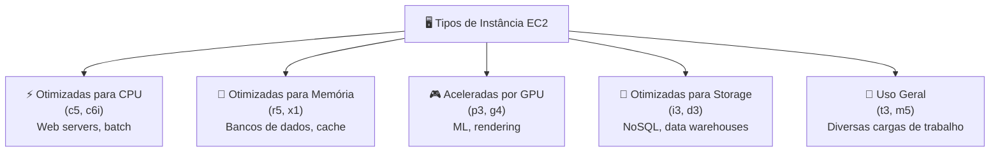

---

## 💾 2. Amazon EBS (Elastic Block Store)

O Amazon EBS fornece volumes de armazenamento em bloco de alto desempenho para uso com instâncias EC2. Pense no EBS como o **"disco rígido"** da sua instância virtual.

### Conceitos Chave

- **Persistência:** Os dados persistem mesmo se a instância for interrompida ou encerrada (se configurado).
- **Snapshots:** Backups incrementais que são salvos no Amazon S3.
- **Tipos de Volume:**
  - **SSD (gp3/io2):** Para cargas de trabalho transacionais e bancos de dados.
  - **HDD (st1/sc1):** Para grandes volumes de dados e processamento sequencial.
- **Elasticidade:** Altere o tamanho ou o tipo de volume sem tempo de inatividade.

### Tipos de Volume EBS

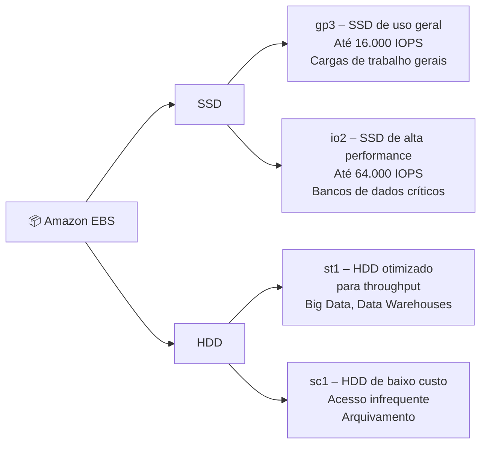

### Ciclo de Vida de um Snapshot EBS

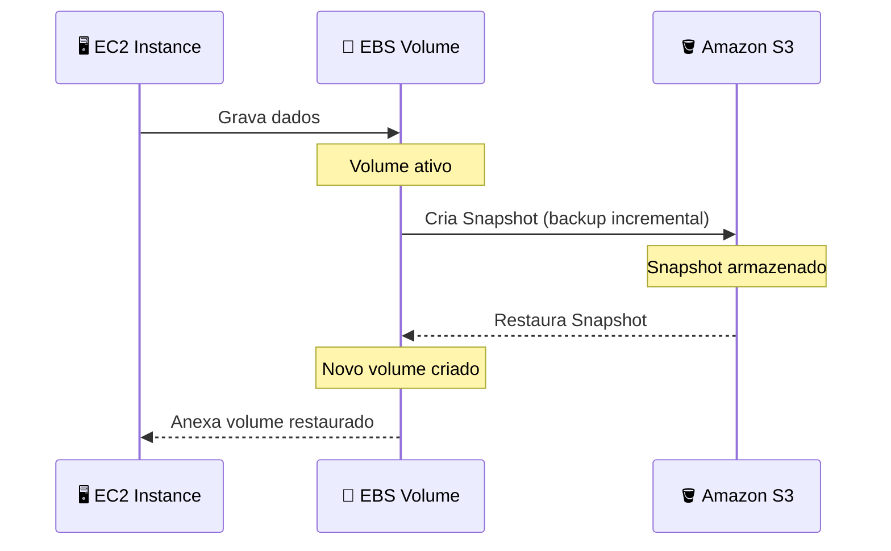

---

## 💿 3. AMI (Amazon Machine Image)

Uma AMI é um **modelo** que contém a configuração de software (sistema operacional, servidor de aplicativos e aplicações) necessária para lançar uma instância.

### Componentes de uma AMI

- **Template do Volume Raiz:** Contém o SO e aplicações instaladas.
- **Permissões de Lançamento:** Define quais contas AWS podem usar a AMI.
- **Mapeamento de Dispositivos de Bloco:** Especifica os volumes EBS a serem anexados à instância no lançamento.

### Ciclo de Vida de uma AMI

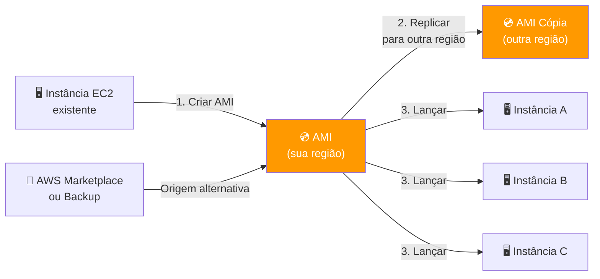

---

## 🔗 Relacionamento entre os Componentes

A relação entre esses três serviços é o que permite a flexibilidade da nuvem:

1. Você escolhe uma **AMI** (o "molde" do sistema).
2. Você lança uma **instância EC2** baseada nessa AMI.
3. A instância utiliza **volumes EBS** para armazenamento persistente.
4. Você pode criar novos **Snapshots** dos volumes EBS para gerar novas AMIs, fechando o ciclo de backup e replicação de ambiente.

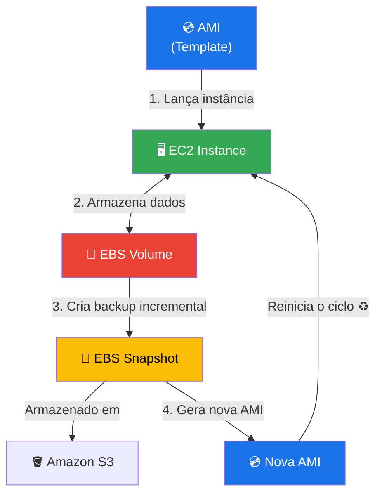

### Resumo do Fluxo

| Etapa | Serviço | Ação |
|-------|---------|------|
| 1 | **AMI** | Fornece o template (SO + configurações) |
| 2 | **EC2** | Instância lançada a partir da AMI |
| 3 | **EBS** | Volume anexado para armazenamento persistente |
| 4 | **Snapshot** | Backup do EBS salvo no S3 |
| 5 | **Nova AMI** | Criada a partir do Snapshot para replicar ambientes |

---

> 📚 **Referências:** [Amazon EC2 Docs](https://docs.aws.amazon.com/ec2/) · [Amazon EBS Docs](https://docs.aws.amazon.com/ebs/) · [AMI Docs](https://docs.aws.amazon.com/AWSEC2/latest/UserGuide/AMIs.html)

---

## ⚙️ AWS Step Functions — Workflows Automatizados

O **AWS Step Functions** é um serviço de orquestração serverless que permite coordenar múltiplos serviços AWS em fluxos de trabalho visuais, chamados de **State Machines** (Máquinas de Estado).

---

## 🧩 4. AWS Step Functions

### O que é?

O Step Functions permite construir aplicações distribuídas e de longa duração combinando serviços como Lambda, ECS, DynamoDB, SNS, SQS e muito mais, sem a necessidade de gerenciar servidores.

### Principais Conceitos

- **State Machine:** Definição do fluxo de trabalho em JSON/YAML usando a linguagem **Amazon States Language (ASL)**.
- **States (Estados):** Cada etapa do fluxo. Podem ser de tarefa, escolha, espera, paralelo, mapa, pass, sucesso ou falha.
- **Execution:** Uma instância em execução de uma State Machine.
- **Transitions:** As transições entre estados, podendo ser condicionais ou sequenciais.
- **Integrations:** Conexões nativas com mais de 220 serviços AWS.

### Tipos de Workflow

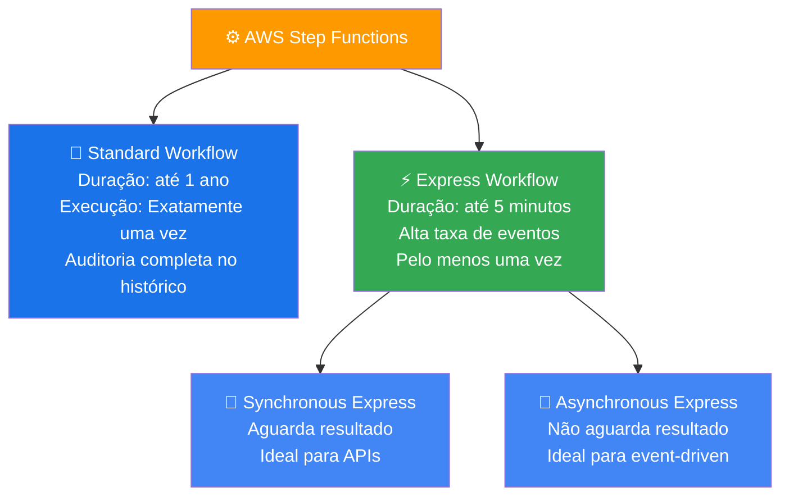

### Tipos de Estado (States)

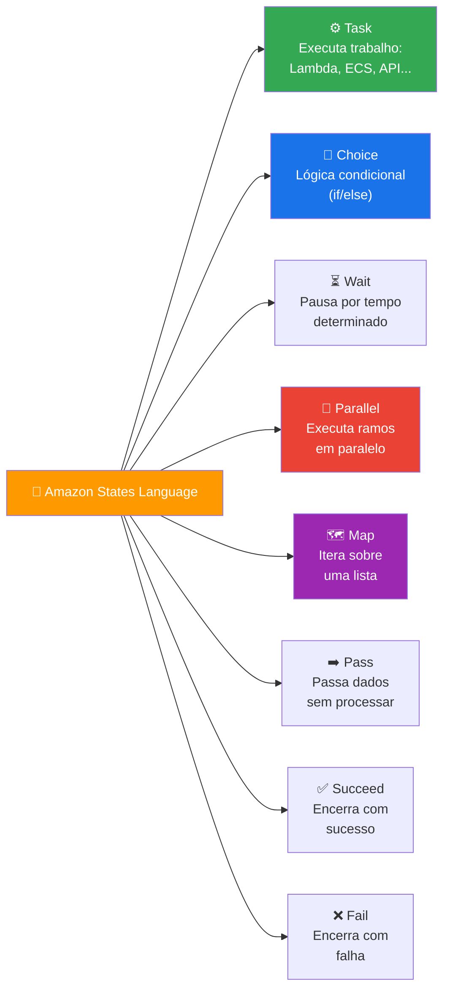

---

## 🔄 Fluxo de Execução de uma State Machine

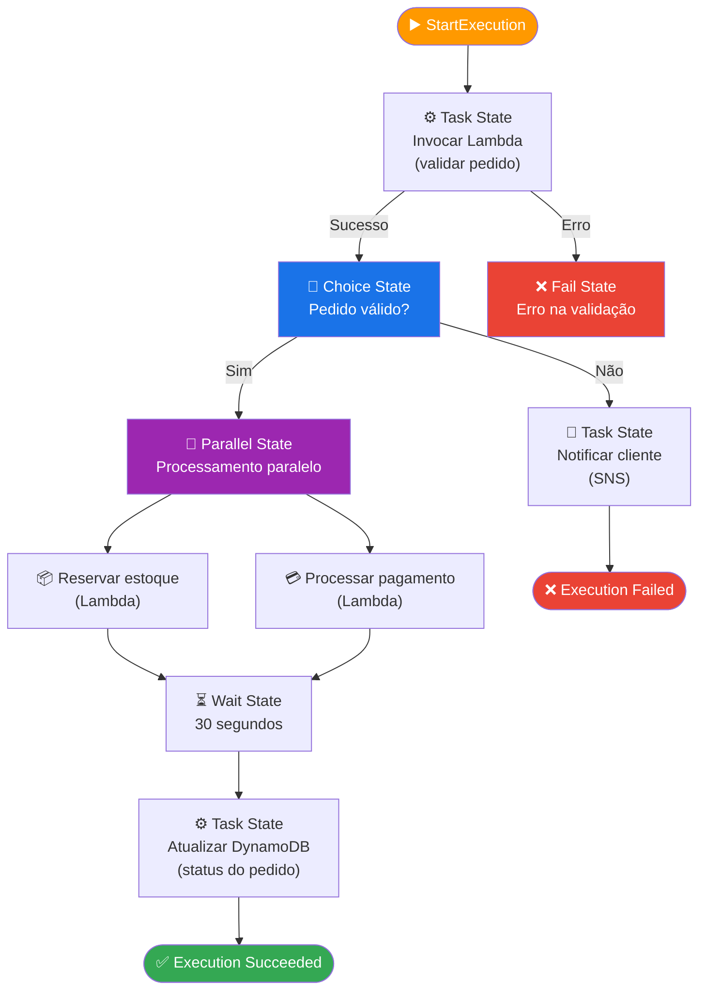

---

## 🔗 Integrações do Step Functions com outros Serviços AWS

O Step Functions oferece dois tipos de integração:

- **Optimistic Integration:** Chama o serviço e continua sem aguardar.
- **`.sync` Integration:** Aguarda o serviço terminar antes de avançar de estado.
- **`.waitForTaskToken`:** Pausa o fluxo até receber um callback externo (útil para aprovações humanas).

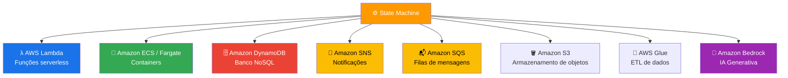

---

## 🧪 Validação: Executando uma State Machine com Lambda

### Etapas Realizadas

| Etapa | Ação | Serviço |
|-------|------|---------|
| 1 | Criar função Lambda para processar a tarefa | AWS Lambda |
| 2 | Criar uma State Machine no Step Functions | Step Functions |
| 3 | Definir os estados em Amazon States Language (JSON) | Step Functions |
| 4 | Configurar a permissão IAM para o Step Functions invocar o Lambda | AWS IAM |
| 5 | Executar a State Machine e monitorar pelo console | Step Functions |
| 6 | Verificar logs de execução no histórico de eventos | Step Functions |

### Exemplo de Definição de Estado (ASL)

```json
{
  "Comment": "Exemplo de State Machine com Lambda",
  "StartAt": "ValidarPedido",
  "States": {
    "ValidarPedido": {
      "Type": "Task",
      "Resource": "arn:aws:lambda:us-east-1:123456789:function:validar-pedido",
      "Next": "VerificarResultado"
    },
    "VerificarResultado": {
      "Type": "Choice",
      "Choices": [
        {
          "Variable": "$.valido",
          "BooleanEquals": true,
          "Next": "PedidoAprovado"
        }
      ],
      "Default": "PedidoRejeitado"
    },
    "PedidoAprovado": {
      "Type": "Succeed"
    },
    "PedidoRejeitado": {
      "Type": "Fail",
      "Error": "PedidoInvalido",
      "Cause": "Pedido não passou na validação"
    }
  }
}
```

---

## 🆚 Comparativo: Step Functions vs Outras Abordagens

| Critério | Step Functions | Lambda Encadeado | Fila SQS Pura |
|----------|---------------|------------------|---------------|
| Visibilidade do fluxo | ✅ Visual e auditável | ❌ Sem visibilidade | ❌ Sem visibilidade |
| Tratamento de erros | ✅ Nativo (Retry/Catch) | ⚠️ Manual no código | ⚠️ Manual |
| Longa duração | ✅ Até 1 ano | ❌ Máx. 15 min | ✅ Sim |
| Orquestração paralela | ✅ Estado Parallel/Map | ⚠️ Complexo | ❌ Difícil |
| Custo por execução | 💲 Por transição de estado | 💲 Por invocação | 💲 Por mensagem |
| Casos de uso ideais | Fluxos complexos | Pipelines simples | Desacoplamento |

---

> 📚 **Referências:** [AWS Step Functions Docs](https://docs.aws.amazon.com/step-functions/) · [Amazon States Language](https://docs.aws.amazon.com/step-functions/latest/dg/concepts-amazon-states-language.html) · [Step Functions Workshops](https://catalog.workshops.aws/stepfunctions/en-US)

---

## 🏗️ AWS CloudFormation — Infraestrutura como Código (IaC)

O **AWS CloudFormation** é um serviço que permite modelar, provisionar e gerenciar recursos da AWS e de terceiros através de **templates declarativos** (JSON ou YAML). Em vez de criar recursos manualmente pelo console, você descreve a infraestrutura desejada e o CloudFormation cuida do provisionamento e da orquestração automaticamente.

---

### 📦 5. Conceitos Fundamentais

| Conceito | Descrição |
|---|---|
| **Template** | Arquivo JSON/YAML que descreve os recursos a serem provisionados. |
| **Stack** | Conjunto de recursos AWS criados, atualizados ou deletados como uma unidade a partir de um template. |
| **Change Set** | Prévia das alterações que serão aplicadas antes de executar um update na Stack. |
| **Drift Detection** | Identifica divergências entre o estado real dos recursos e o template que os originou. |
| **Stack Set** | Permite implantar Stacks em múltiplas contas e regiões AWS de forma centralizada. |

---

### 🧱 Estrutura de um Template CloudFormation

```yaml
AWSTemplateFormatVersion: "2010-09-09"
Description: "Exemplo de template CloudFormation"

Parameters:
  InstanceType:
    Type: String
    Default: t2.micro
    AllowedValues: [t2.micro, t2.small, t2.medium]
    Description: Tipo da instância EC2

Resources:
  MinhaInstanciaEC2:
    Type: AWS::EC2::Instance
    Properties:
      InstanceType: !Ref InstanceType
      ImageId: ami-0abcdef1234567890
      Tags:
        - Key: Name
          Value: MinhaInstancia

Outputs:
  InstanceId:
    Description: ID da instância criada
    Value: !Ref MinhaInstanciaEC2
```

As **seções principais** de um template são:

- **AWSTemplateFormatVersion**: Versão do formato do template.
- **Description**: Descrição legível do que o template faz.
- **Parameters**: Entradas dinâmicas que permitem reutilizar o template.
- **Resources** *(obrigatório)*: Declaração dos recursos AWS a serem criados.
- **Outputs**: Valores exportados após a criação da Stack (ex.: ARNs, IPs, URLs).
- **Mappings**: Mapeamentos estáticos (ex.: AMI por região).
- **Conditions**: Lógica condicional para criação de recursos.

---

### 🔄 Ciclo de Vida de uma Stack

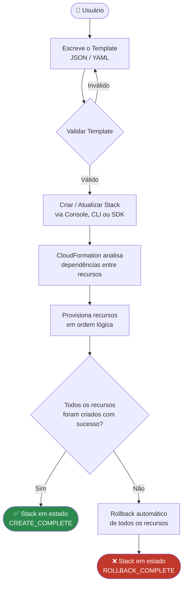

---

### 🔥 Criando Stacks de Firewall (Security Groups) no CloudFormation

Um dos casos de uso mais comuns é definir **Security Groups** como código, garantindo consistência e rastreabilidade das regras de rede.

```yaml
Resources:
  MeuSecurityGroup:
    Type: AWS::EC2::SecurityGroup
    Properties:
      GroupDescription: "Security Group para servidor web"
      VpcId: !Ref MinhaVPC
      SecurityGroupIngress:
        - IpProtocol: tcp
          FromPort: 80
          ToPort: 80
          CidrIp: 0.0.0.0/0
        - IpProtocol: tcp
          FromPort: 443
          ToPort: 443
          CidrIp: 0.0.0.0/0
      SecurityGroupEgress:
        - IpProtocol: -1
          CidrIp: 0.0.0.0/0
```

#### Fluxo de aplicação de regras do Security Group

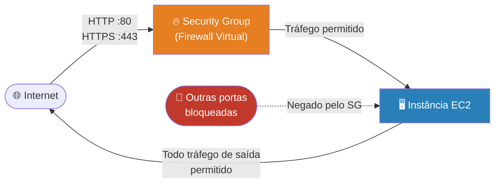

---

### 🆚 CloudFormation vs Abordagens Alternativas

| Critério | CloudFormation | Terraform | Console Manual |
|---|---|---|---|
| **IaC nativo AWS** | ✅ Integrado | ⚠️ Terceiro | ❌ |
| **Multi-cloud** | ❌ Apenas AWS | ✅ Sim | ✅ (via console cada) |
| **Rollback automático** | ✅ Nativo | ⚠️ Manual | ❌ |
| **Change Sets** | ✅ Pré-visualização | ✅ `plan` | ❌ |
| **Drift Detection** | ✅ Nativo | ⚠️ Via `refresh` | ❌ |
| **Curva de aprendizado** | 🟡 Média | 🟡 Média | 🟢 Baixa |
| **Rastreabilidade** | ✅ Tags + Events | ✅ State file | ❌ |

---

### 🧪 Etapas Práticas — Primeira Stack com CloudFormation

| Etapa | Ação | Serviço / Ferramenta |
|---|---|---|
| 1 | Escrever o template YAML/JSON | Editor local ou AWS CloudShell |
| 2 | Validar o template | `aws cloudformation validate-template` |
| 3 | Criar a Stack | Console AWS ou AWS CLI |
| 4 | Monitorar os eventos de criação | CloudFormation Console → Events |
| 5 | Verificar os recursos criados | CloudFormation Console → Resources |
| 6 | Gerar um Change Set para atualização | CloudFormation → Change Sets |
| 7 | Executar Drift Detection | CloudFormation → Stack Actions |
| 8 | Deletar a Stack (limpeza) | CloudFormation → Delete Stack |

---

### 🔗 Integração do CloudFormation com os Serviços já Estudados

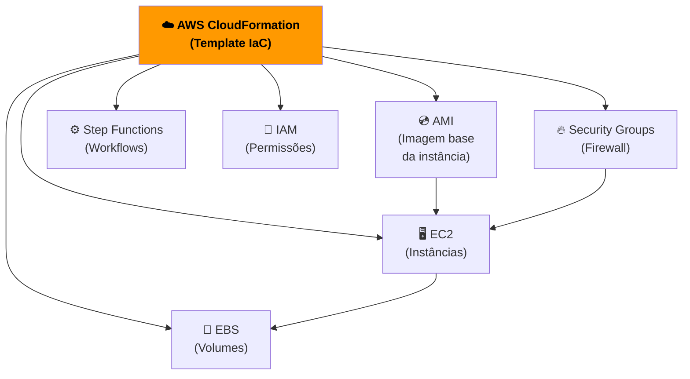

> **Insight:** O CloudFormation atua como a **camada de orquestração declarativa** que une todos os serviços estudados neste bootcamp, permitindo reproduzir ambientes completos de forma consistente e auditável.

---

📚 **Referências:** [AWS CloudFormation Docs](https://docs.aws.amazon.com/cloudformation/) · [Template Reference](https://docs.aws.amazon.com/AWSCloudFormation/latest/UserGuide/template-reference.html) · [CloudFormation Workshop](https://catalog.workshops.aws/cfn101/en-US)


---

## 🪣 Amazon S3 — Armazenamento de Objetos na Nuvem

O **Amazon Simple Storage Service (S3)** é um serviço de armazenamento de objetos com escalabilidade, disponibilidade de dados, segurança e performance líderes do setor. É o backbone de armazenamento para inúmeros serviços da AWS, incluindo backups, data lakes, hospedagem de sites estáticos e gatilhos de eventos serverless.

### 📦 Conceitos Fundamentais do S3

| Conceito | Descrição |
|---|---|
| **Bucket** | Contêiner lógico para armazenar objetos. O nome é globalmente único. |
| **Objeto** | A unidade de armazenamento — composto por dados, metadados e uma chave (key). |
| **Key** | O identificador único de um objeto dentro de um bucket (equivale ao "caminho" do arquivo). |
| **Região** | Localização física onde o bucket e seus objetos são armazenados. |
| **Versioning** | Mantém múltiplas versões de um mesmo objeto, permitindo recuperação de versões anteriores. |
| **Storage Classes** | Diferentes níveis de armazenamento com trade-offs de custo x disponibilidade (S3 Standard, IA, Glacier, etc.). |
| **Presigned URL** | URL temporária que concede acesso a um objeto privado sem necessidade de credenciais AWS. |

### 🔐 Políticas e Controle de Acesso

O S3 oferece múltiplas camadas de segurança que podem ser combinadas:

- **Bucket Policy**: Políticas baseadas em recursos (JSON) que definem permissões a nível de bucket ou objeto para contas e serviços AWS.
- **IAM Policy**: Permissões atribuídas a usuários, grupos ou roles IAM para acessar recursos S3.
- **ACL (Access Control List)**: Controle de acesso legado por objeto ou bucket (recomenda-se usar Bucket Policy).
- **Block Public Access**: Configuração que bloqueia qualquer acesso público, sobrescrevendo policies existentes.

### ⚡ S3 Event Notifications

Um dos recursos mais poderosos do S3 é a capacidade de **emitir notificações de eventos** quando objetos são criados, removidos ou restaurados. Esses eventos podem acionar:

- **AWS Lambda** (processamento serverless)
- **Amazon SQS** (enfileiramento de mensagens)
- **Amazon SNS** (notificações)
- **Amazon EventBridge** (roteamento avançado de eventos)

### 🔄 Ciclo de Vida de um Objeto no S3

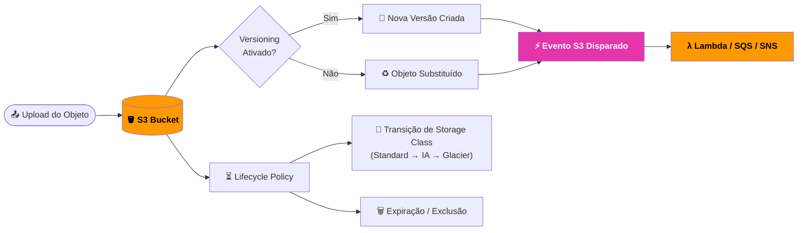

📚 **Referências:** [Amazon S3 Docs](https://docs.aws.amazon.com/s3/) · [S3 Event Notifications](https://docs.aws.amazon.com/AmazonS3/latest/userguide/EventNotifications.html) · [S3 Storage Classes](https://aws.amazon.com/s3/storage-classes/)

---

## λ AWS Lambda — Computação Serverless

O **AWS Lambda** é um serviço de computação serverless que executa código em resposta a eventos, gerenciando automaticamente a infraestrutura subjacente. Você paga apenas pelo tempo de computação consumido — sem custos quando o código não está em execução.

### 🧠 Conceitos Fundamentais do Lambda

| Conceito | Descrição |
|---|---|
| **Função** | Unidade de código implantável. Definida por código + configuração + permissões IAM. |
| **Handler** | Ponto de entrada da função — o método invocado pelo Lambda ao receber um evento. |
| **Event** | Objeto JSON que contém dados de entrada para a função (ex.: metadados do objeto S3). |
| **Context** | Objeto que fornece informações sobre a invocação, função e ambiente de execução. |
| **Trigger** | Serviço ou recurso que invoca a função (S3, API Gateway, SQS, EventBridge, etc.). |
| **Layer** | Componente reutilizável (bibliotecas, runtimes) que pode ser compartilhado entre funções. |
| **Cold Start** | Latência inicial quando uma nova instância de execução é inicializada pela primeira vez. |
| **Concorrência** | Número de instâncias da função em execução simultânea. |

### 📐 Limites e Configurações

| Parâmetro | Limite |
|---|---|
| Timeout máximo | 15 minutos |
| Memória | 128 MB a 10.240 MB |
| Tamanho do pacote de implantação | 50 MB (zip) / 250 MB (descomprimido) |
| Armazenamento temporário (/tmp) | 512 MB a 10.240 MB |
| Concorrência padrão por região | 1.000 execuções simultâneas |
| Variáveis de ambiente | Máx. 4 KB |

### 🔄 Ciclo de Execução de uma Função Lambda

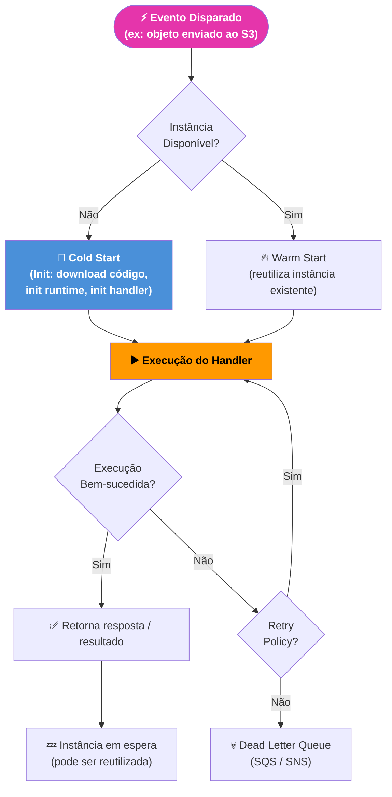

📚 **Referências:** [AWS Lambda Docs](https://docs.aws.amazon.com/lambda/) · [Lambda Best Practices](https://docs.aws.amazon.com/lambda/latest/dg/best-practices.html) · [Lambda Quotas](https://docs.aws.amazon.com/lambda/latest/dg/gettingstarted-limits.html)

---

## 🔗 Integração S3 + Lambda — Processamento Orientado a Eventos

A combinação de **S3 + Lambda** é um dos padrões serverless mais utilizados na AWS. Ela permite construir pipelines de processamento de arquivos totalmente gerenciados, sem provisionamento de servidores, que escalam automaticamente conforme o volume de uploads.

### 🔄 Fluxo de Processamento de Arquivos

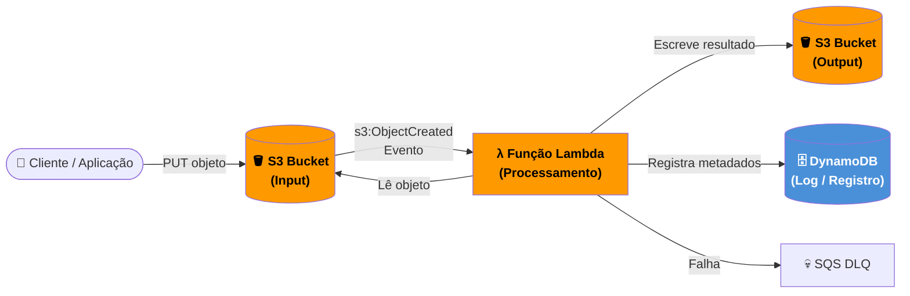

### 📝 Registro no DynamoDB

Uma prática comum ao processar arquivos via Lambda é **registrar os metadados de cada execução no DynamoDB**, criando um histórico auditável:

| Campo | Descrição | Exemplo |
|---|---|---|
| `fileId` (PK) | Identificador único do arquivo | `img_20240610_abc123` |
| `bucketName` | Bucket de origem | `meu-bucket-input` |
| `objectKey` | Caminho do objeto no S3 | `uploads/foto.jpg` |
| `fileSize` | Tamanho em bytes | `204800` |
| `processedAt` | Timestamp do processamento | `2024-06-10T14:32:00Z` |
| `status` | Resultado do processamento | `SUCCESS` / `ERROR` |

### 🧪 Etapas Práticas — Upload com Processamento e Registro

| Etapa | Ação | Serviço / Ferramenta |
|---|---|---|
| 1 | Criar bucket S3 de input e output | Amazon S3 |
| 2 | Criar tabela DynamoDB para registro | Amazon DynamoDB |
| 3 | Criar role IAM com permissões S3 + DynamoDB | AWS IAM |
| 4 | Desenvolver e implantar a função Lambda | AWS Lambda |
| 5 | Configurar trigger S3 na função (evento `s3:ObjectCreated:*`) | Amazon S3 → Lambda |
| 6 | Fazer upload de arquivo de teste no bucket de input | AWS Console / CLI |
| 7 | Verificar logs de execução no CloudWatch | Amazon CloudWatch |
| 8 | Confirmar registro criado na tabela DynamoDB | Amazon DynamoDB |

📚 **Referências:** [Tutoriais S3 + Lambda](https://docs.aws.amazon.com/lambda/latest/dg/with-s3-example.html) · [DynamoDB Developer Guide](https://docs.aws.amazon.com/amazondynamodb/latest/developerguide/)

---

## 🔭 S3 Object Lambda — Transformação em Tempo Real

O **S3 Object Lambda** permite adicionar código (via AWS Lambda) para processar e transformar dados **no momento em que são recuperados do S3**, sem necessidade de duplicar dados ou criar cópias transformadas. A transformação acontece inline, entre o S3 e o cliente solicitante.

**Casos de uso comuns:**
- Redimensionar imagens dinamicamente conforme o tamanho solicitado
- Mascarar dados sensíveis (PII) retornados para determinados usuários
- Converter formatos de arquivo (ex.: JSON → CSV) em tempo real
- Enriquecer objetos com dados de outras fontes antes da entrega

### 🔄 Fluxo do S3 Object Lambda

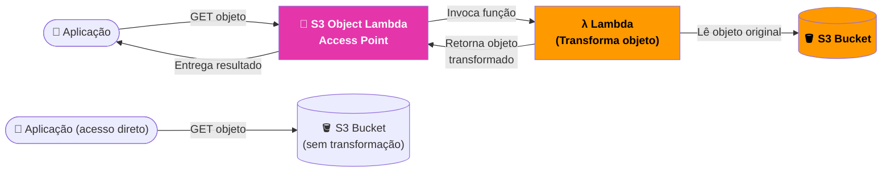

### 🆚 S3 Padrão vs S3 Object Lambda

| Critério | S3 Padrão | S3 Object Lambda |
|---|---|---|
| Transformação de dados | ❌ Não | ✅ Sim (via Lambda) |
| Múltiplas visões do mesmo dado | ❌ Requer cópias | ✅ Uma fonte, N visões |
| Latência | 🟢 Mínima | 🟡 Adiciona tempo da Lambda |
| Custo adicional | 💲 Apenas S3 | 💲 S3 + Lambda + Access Point |
| Maskara de PII em tempo real | ❌ Não | ✅ Sim |
| Provisionamento de infra | ✅ Zero | ✅ Zero |

📚 **Referências:** [S3 Object Lambda Docs](https://docs.aws.amazon.com/AmazonS3/latest/userguide/transforming-objects.html) · [Automatizar S3 Object Lambda com CloudFormation](https://aws.amazon.com/blogs/aws/automate-the-s3-object-lambda-setup-with-an-aws-cloudformation-template/)

---

## 🖥️ LocalStack — Desenvolvimento e Testes Locais

O **LocalStack** é uma plataforma de desenvolvimento em nuvem que emula os serviços da AWS localmente na sua máquina. Ele permite desenvolver e testar aplicações AWS sem custos reais, sem acesso à internet e com feedback imediato.

**Serviços emulados relevantes para este módulo:** S3, Lambda, DynamoDB, SQS, SNS, IAM, CloudFormation.

### ⚙️ Configuração e Comandos Essenciais

```bash
# Instalar LocalStack via pip
pip install localstack

# Iniciar LocalStack (via Docker)
localstack start

# Configurar AWS CLI para usar LocalStack (endpoint local)
aws configure set aws_access_key_id "test"
aws configure set aws_secret_access_key "test"
aws configure set region "us-east-1"

# Criar bucket S3 localmente
aws --endpoint-url=http://localhost:4566 s3 mb s3://meu-bucket-local

# Listar buckets locais
aws --endpoint-url=http://localhost:4566 s3 ls

# Fazer upload de arquivo
aws --endpoint-url=http://localhost:4566 s3 cp arquivo.txt s3://meu-bucket-local/

# Criar função Lambda localmente
aws --endpoint-url=http://localhost:4566 lambda create-function \
  --function-name minha-funcao \
  --runtime python3.12 \
  --role arn:aws:iam::000000000000:role/lambda-role \
  --handler handler.lambda_handler \
  --zip-file fileb://function.zip

# Invocar função Lambda localmente
aws --endpoint-url=http://localhost:4566 lambda invoke \
  --function-name minha-funcao \
  --payload '{"key": "value"}' \
  output.json

# Criar tabela DynamoDB localmente
aws --endpoint-url=http://localhost:4566 dynamodb create-table \
  --table-name registros-arquivos \
  --attribute-definitions AttributeName=fileId,AttributeType=S \
  --key-schema AttributeName=fileId,KeyType=HASH \
  --billing-mode PAY_PER_REQUEST
```

### 🔄 Fluxo de Trabalho com LocalStack

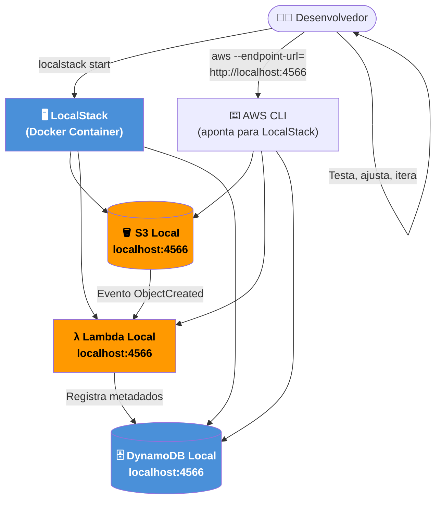

> **Insight:** O LocalStack elimina o ciclo de **deploy → testar → corrigir → deploy** na nuvem real, reduzindo drasticamente o tempo de desenvolvimento e os custos. Todo o fluxo S3 → Lambda → DynamoDB pode ser validado localmente antes de qualquer deploy em produção.

📚 **Referências:** [LocalStack Docs](https://docs.localstack.cloud/) · [LocalStack GitHub](https://github.com/localstack/localstack) · [AWS CLI com LocalStack](https://docs.localstack.cloud/user-guide/integrations/aws-cli/)
