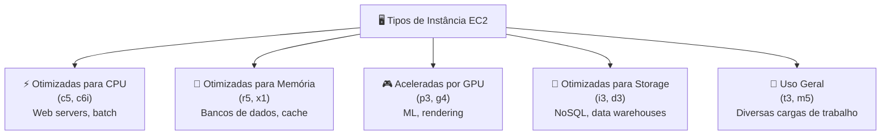
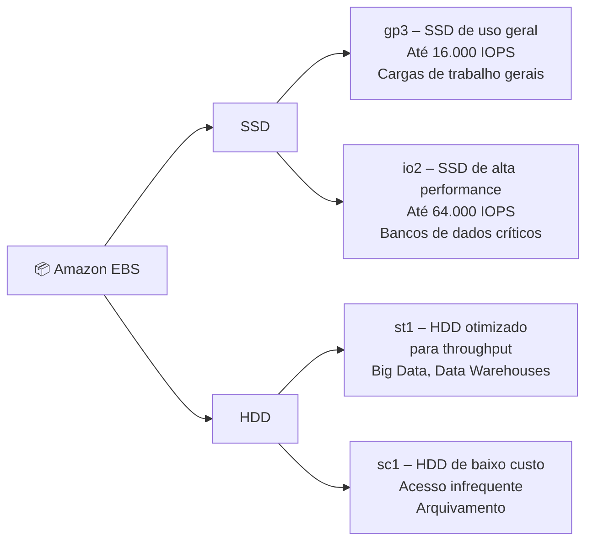
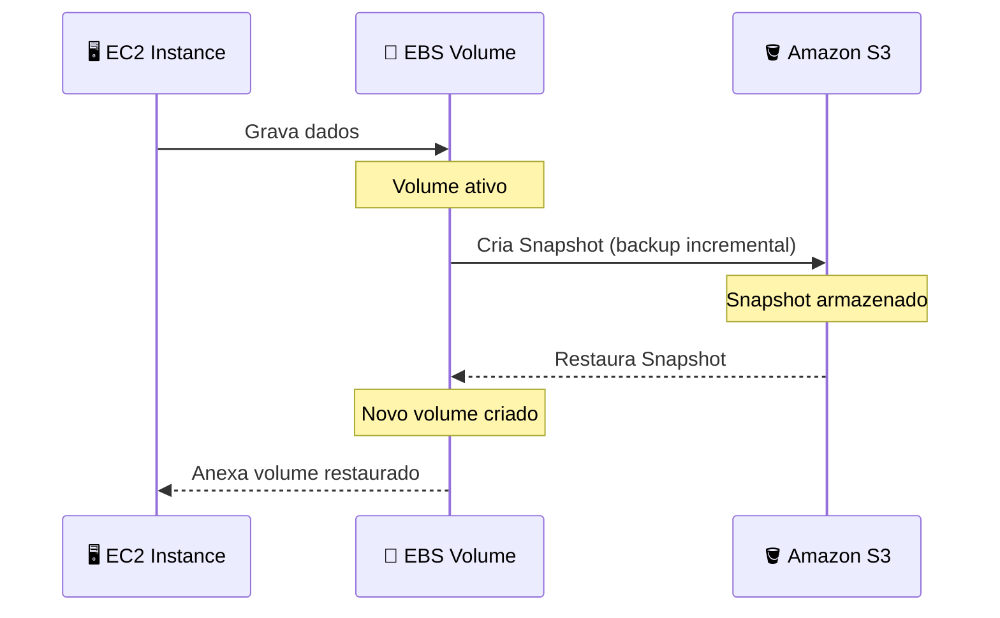
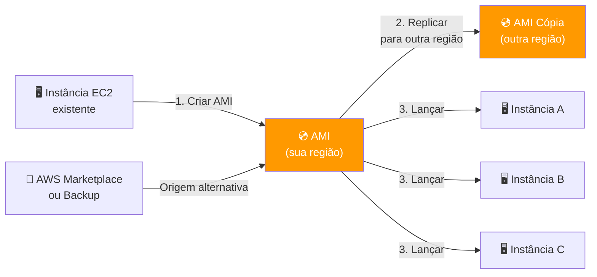
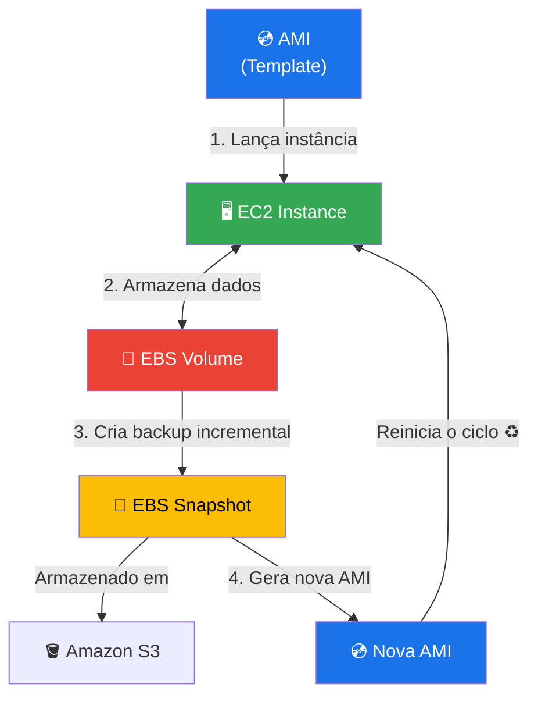

# GFT - Fundamentos de Cloud com AWS

Anotações e resumos do curso **GFT - Fundamentos de Cloud com AWS**, cobrindo os principais conceitos e serviços da Amazon Web Services estudados ao longo do programa.

---

## ☁️ EC2, EBS e AMI — Fundamentos de Infraestrutura

Visão geral técnica e prática sobre os pilares fundamentais da infraestrutura computacional na AWS: **Amazon Elastic Compute Cloud (EC2)**, **Amazon Elastic Block Store (EBS)** e **Amazon Machine Images (AMI)**.

---

## 🚀 1. Amazon EC2 (Elastic Compute Cloud)

O Amazon EC2 é um serviço que fornece capacidade computacional escalável na nuvem. Ele elimina a necessidade de investir em hardware antecipadamente, permitindo que você lance servidores virtuais conforme a demanda.

### Principais Características

- **Instâncias:** Servidores virtuais que executam suas aplicações.
- **Escalabilidade:** Capacidade de aumentar ou diminuir recursos em minutos.
- **Tipos de Instância:** Otimizadas para diferentes casos de uso (CPU, Memória, GPU, Armazenamento).
- **Segurança:** Controle total via Security Groups (firewalls virtuais).

### Tipos de Instância EC2

---

## 💾 2. Amazon EBS (Elastic Block Store)

O Amazon EBS fornece volumes de armazenamento em bloco de alto desempenho para uso com instâncias EC2. Pense no EBS como o **"disco rígido"** da sua instância virtual.

### Conceitos Chave

- **Persistência:** Os dados persistem mesmo se a instância for interrompida ou encerrada (se configurado).
- **Snapshots:** Backups incrementais que são salvos no Amazon S3.
- **Tipos de Volume:**
  - **SSD (gp3/io2):** Para cargas de trabalho transacionais e bancos de dados.
  - **HDD (st1/sc1):** Para grandes volumes de dados e processamento sequencial.
- **Elasticidade:** Altere o tamanho ou o tipo de volume sem tempo de inatividade.

### Tipos de Volume EBS

### Ciclo de Vida de um Snapshot EBS

---

## 💿 3. AMI (Amazon Machine Image)

Uma AMI é um **modelo** que contém a configuração de software (sistema operacional, servidor de aplicativos e aplicações) necessária para lançar uma instância.

### Componentes de uma AMI

- **Template do Volume Raiz:** Contém o SO e aplicações instaladas.
- **Permissões de Lançamento:** Define quais contas AWS podem usar a AMI.
- **Mapeamento de Dispositivos de Bloco:** Especifica os volumes EBS a serem anexados à instância no lançamento.

### Ciclo de Vida de uma AMI

---

## 🔗 Relacionamento entre os Componentes

A relação entre esses três serviços é o que permite a flexibilidade da nuvem:

1. Você escolhe uma **AMI** (o "molde" do sistema).
2. Você lança uma **instância EC2** baseada nessa AMI.
3. A instância utiliza **volumes EBS** para armazenamento persistente.
4. Você pode criar novos **Snapshots** dos volumes EBS para gerar novas AMIs, fechando o ciclo de backup e replicação de ambiente.

### Resumo do Fluxo

| Etapa | Serviço | Ação |
|-------|---------|------|
| 1 | **AMI** | Fornece o template (SO + configurações) |
| 2 | **EC2** | Instância lançada a partir da AMI |
| 3 | **EBS** | Volume anexado para armazenamento persistente |
| 4 | **Snapshot** | Backup do EBS salvo no S3 |
| 5 | **Nova AMI** | Criada a partir do Snapshot para replicar ambientes |

---

> 📚 **Referências:** [Amazon EC2 Docs](https://docs.aws.amazon.com/ec2/) · [Amazon EBS Docs](https://docs.aws.amazon.com/ebs/) · [AMI Docs](https://docs.aws.amazon.com/AWSEC2/latest/UserGuide/AMIs.html)
